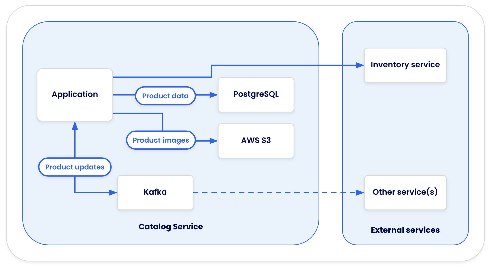
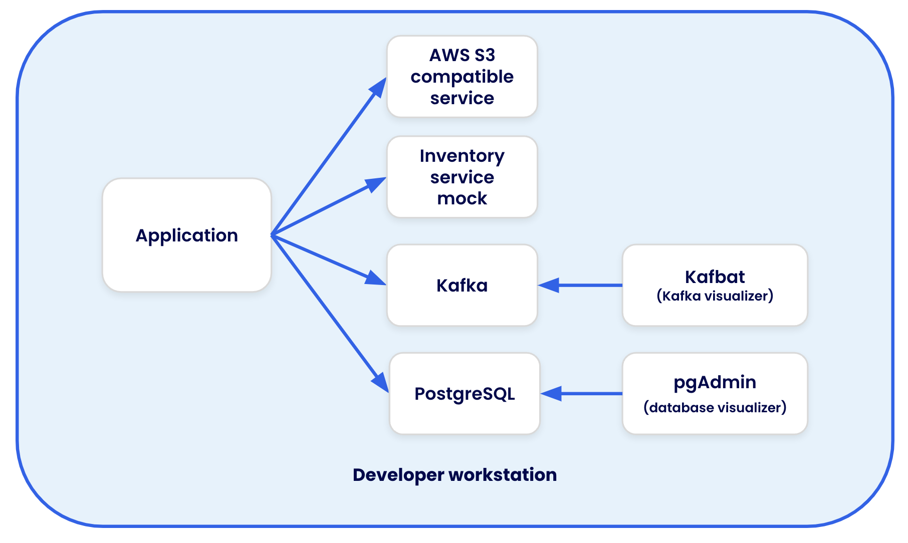

# Introduction to Product Catalog Service Workshop

In this labspace, you're going to learn how to build and run a Product Catalog application using Docker. 

## What You'll Learn

- How to containerize a Product Catalog application
- Working with Docker and Docker Compose
- Integration testing with Testcontainers
- Securing the container images using Docker Scout

## Application architecture

This sample app provides an API that utilizes the following setup:

- Data is stored in a PostgreSQL database
- Product images are stored in a AWS S3 bucket
- Inventory data comes from an external inventory service
- Updates to products are published to a Kafka cluster

During development, containers provide the following services:

- PostgreSQL and Kafka runs directly in a container
- LocalStack is used to run S3 locally
- WireMock is used to mock the external inventory service
- pgAdmin and kafbat are added to visualize the PostgreSQL database and Kafka cluster

## Prerequisites

- Basic understanding of Docker concepts
- Familiarity with Node.js development
- Access to a terminal/command line

Let's get started!
